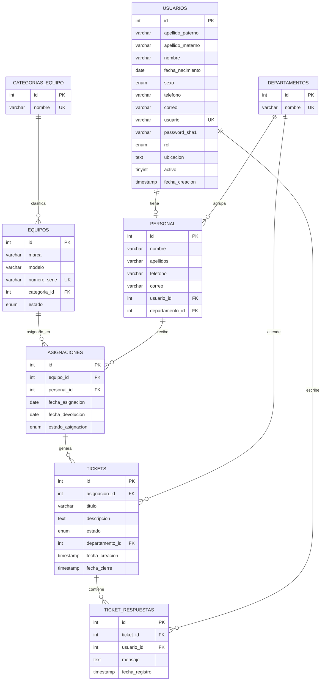

# Diagrama Relacional de la Base de Datos

Este diagrama representa la estructura de la base de datos `helpdesk_mvc_db` utilizada en el sistema HelpDesk MVC.

## Resumen de Relaciones
- **Personal**: Se vincula a un **Usuario** (para acceso al sistema) y a un **Departamento**.
- **Equipos**: Pertenecen a una **Categoría** y pueden estar en múltiples **Asignaciones** (historial).
- **Asignaciones**: Relacionan un **Equipo** con un miembro del **Personal**.
- **Tickets**: Se crean a partir de una **Asignación** específica y pueden ser escalados a un **Departamento**.
- **Respuestas**: Permiten el hilo de comunicación en un **Ticket** por parte de diferentes **Usuarios**.
